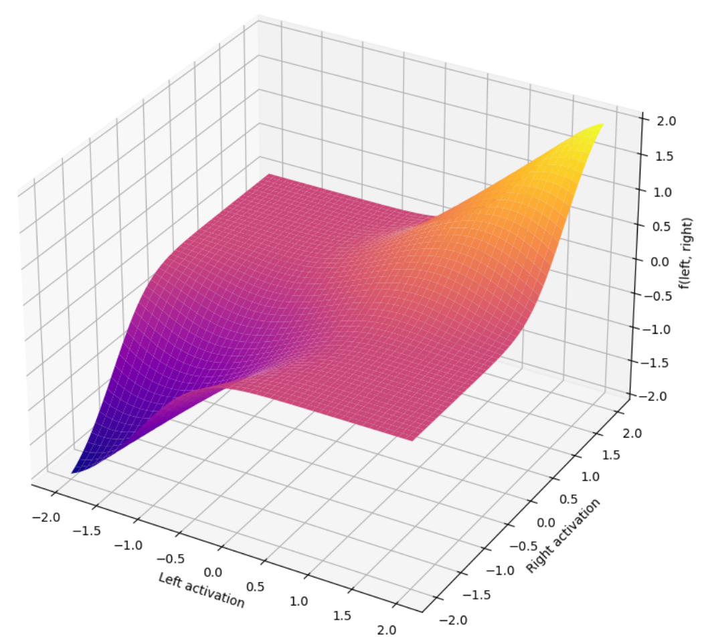
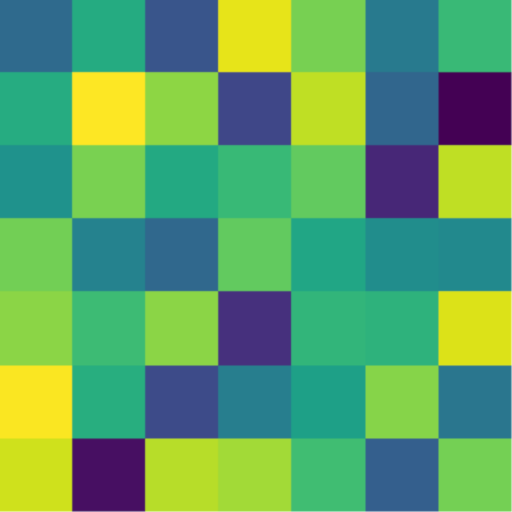

# DeltaConvNeXt

  

  An experimental CNN-based block inspired by differential transformers 

## What it does
This block adds the ability for ConvNeXt to prioritise certain signals within the feature map. 

## How it works

Within ConvNeXt, there is a 7x7 CNN layer that expracts local features within the input. We leverage this layer by duplicating it into a "left" and a "right" signal.  
We can then use the following formula to extract matching values:
 
$f(x_{\text{left}}, x_{\text{right}}) = ( x_{\text{left}} + x_{\text{right}} ) \cdot \left( \frac{2}{1 + e^{( x_{\text{left}} - x_{\text{right}} )^2 \cdot \lambda}} \right)$

## Example

<table>
  <tr>
  </tr> 
  <tr>
     <td>
Left Signal
</td>
     <td>
Right Signal
</td>
     <td>
Combined
</td>
  </tr>
</table>

As you can see, matching values are kept, while dissimilar ones are subdued.
